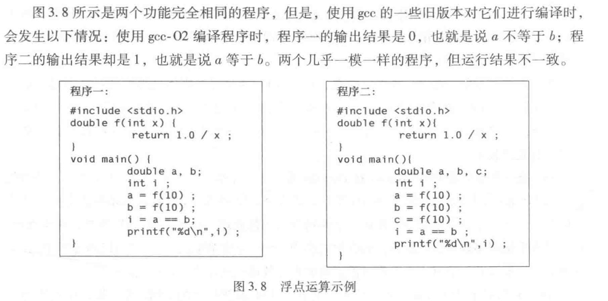

T_M2=1.5 T_M1
时钟周期数 = 用户cpu时间 * 时钟频率

用户cpu时间：运行用户程序代码的时间

二维矩阵拷贝赋值：1.先行后列 2.先列后行
时间上，2比1慢21倍

二维矩阵存储方式：按行存储。a11 a12 a13 a21 a22 a23...

缓存：使用1可以直接全部取出被拷贝对象的值，而2需要反复取出


编译选项：-O0:无编译优化 -O1:第一级优化 -O2:第二级优化


从c语言源程序文件到可执行文件：
```
gcc -O1 prog1.c prog2.c -o prog
```

预处理、编译、汇编、链接
```
gcc -E prog1.c -o prog1.i // 生成预处理结果文件
gcc -S prog1.i -o prog1.s // 编译，生成汇编代码文件
gcc -c prog1.s -o prog1.o // 汇编，生成可重定位目标文件
gcc prog1.o prog2.o -o prog // 链接两个可重定位目标文件，生成可执行文件
```

.i .s：可显示的文本文件
.o：不可显示的二进制文件

反汇编：机器指令->汇编指令
```
objdump -d prog1.o
```

汇编格式：AT&T、Intel

AT&T格式：
长度后缀：表示操作数长度
    b：字节 w：字 l：双字 q：四字
寄存器操作数：% + 寄存器名 eg %r1 即为 R[r1]
存储器操作数：偏移量（基址寄存器，变址寄存器，比例因子），存储单元地址即为 基址寄存器的内容+变址寄存器的内容*4 + 100
汇编指令：op src, dst：dst<-dst op src


通过內联汇编，在c程序中嵌入汇编语言



1中a的结果被从80位的浮点寄存器写入64位的存储区，产生精度损失，而b因为没有被写入存储区，所以没有精度损失。
2中a、b都有精度损失，而c没有。

