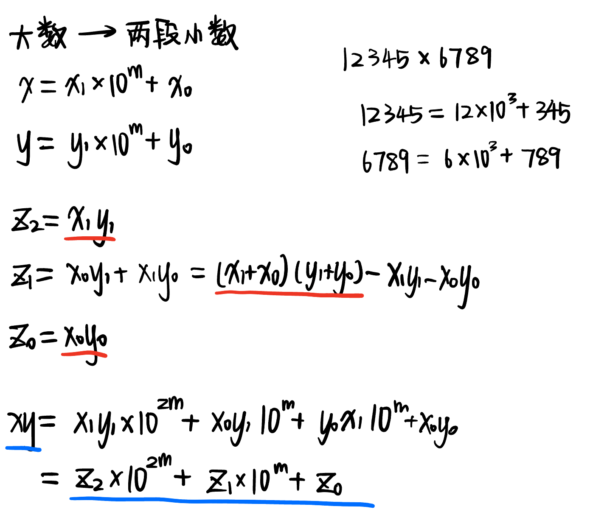
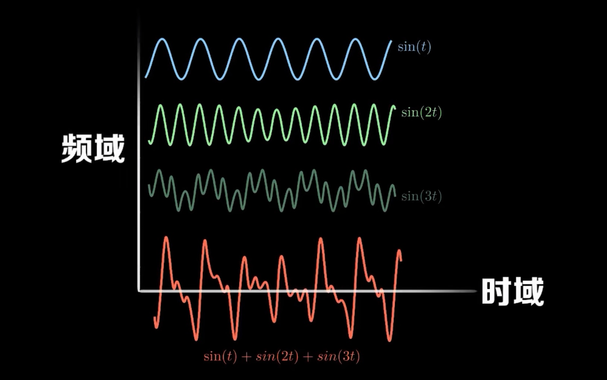
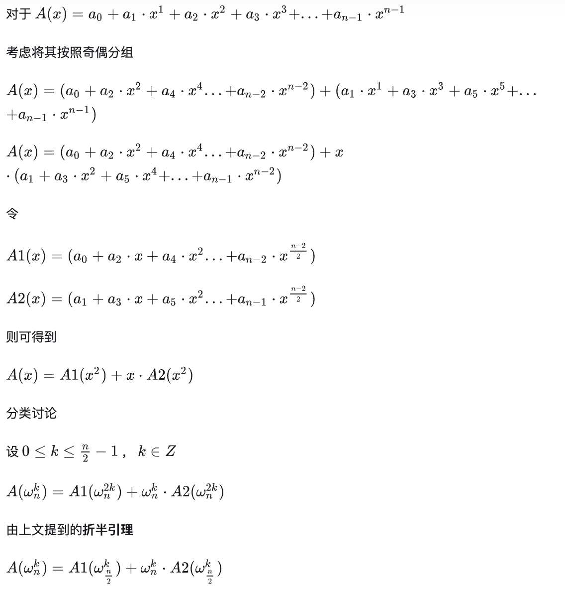
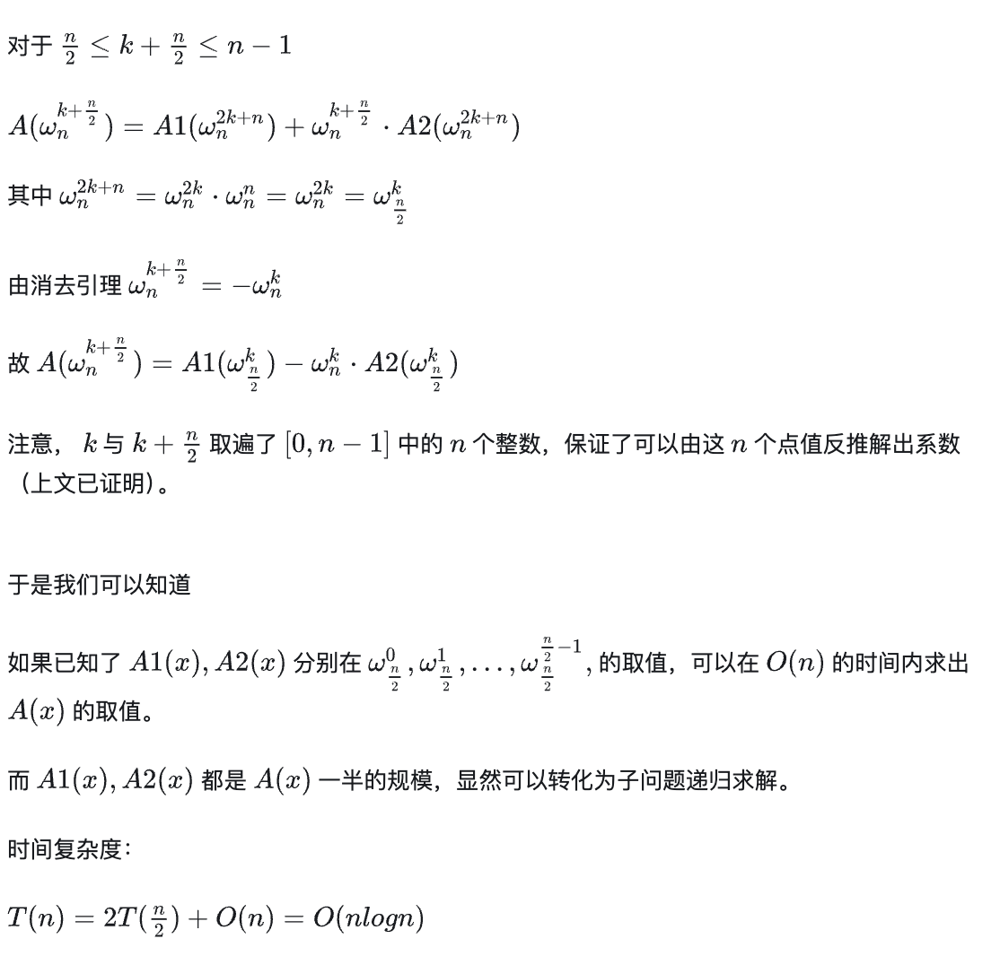

# 高精度乘法

输入：从个位到高位（逆序）

index

- 手算法
- Karatsuba 算法
- 快速傅立叶变换(FFP)
- 测量算法时间

## 手算法

时间复杂度：

$$
O(n^2)
$$

```cpp
string add(string a, string b){ // a为逆序，b为逆序，返回逆序的结果
    int carry = 0;
    int len = min(a.size(), b.size());

    string res;
    int i = 0;
    for(; i < len; i++){
        int sum = a[i] - '0' + b[i] - '0' + carry;
        carry = sum / 10;
        res += to_string(sum % 10);
    }
    if(a.size() > b.size()){
        for(; i < a.size(); i++){
            int sum = a[i] - '0' + carry;
            carry = sum / 10;
            res += to_string(sum % 10);    
        }
    }else if(a.size() < b.size()){
        for(; i < b.size(); i++){
            int sum = b[i] - '0' + carry;
            carry = sum / 10;
            res += to_string(sum % 10);    
        }  
    }
    if(carry) res += to_string(carry);
    return res;
}

int main(){
    int n, m;
    cin >> n >> m;
    string x, y;
    char ch;
    for(int i = 0; i < n; i++){
        cin >> ch;
        x += ch;
    }
    for(int i = 0; i < m; i++){
        cin >> ch;
        y += ch;
    }
    if(x == "0" || y == "0"){
        cout << 0;
        return 0;
    }
    int i;
    string res = "0";
    for(i = 0; i < m; i++){ // y
        string pro;
        int j = 0, carry = 0;
        if(y[i] == '0'){
            pro = "0";
        }
        else{
            for(; j < n; j++){
                int num = ((x[j] - '0') * (y[i] - '0')) + carry;
                carry = num / 10;
                num %= 10;
                pro += to_string(num);  
            }
            if(carry) pro += to_string(carry);
            int tmp = i;
            while(tmp--){
                pro = "0" + pro;
            }
        }
        res = add(res, pro);
    }
    int len = res.size();
    for(int i = len - 1; i >= 0; i--) cout << res[i];
}

```

## Karatsuba 算法

时间复杂度：

$$
O(n \log_{2}{3})
$$

思路：分治与递归

将较大的数拆分成两个较小的数运算，一直下去，直到那两个较小的数的位数达到1或2量级



```cpp
string remove_pre0(string s){
    while(s.size() > 1 && s[0] == '0') s = s.substr(1);
    return s;
}
string remove_back0(string s){
    while(s.size() > 1 && s[s.size() - 1] == '0') s = s.substr(0, s.size() - 1);
    return s;
}

string add(string a, string b){ // a为逆序，b为逆序，返回逆序的结果
    int carry = 0;
    int len = min(a.size(), b.size());

    string res;
    int i = 0;
    for(; i < len; i++){
        int sum = a[i] - '0' + b[i] - '0' + carry;
        carry = sum / 10;
        res += to_string(sum % 10);
    }
    if(a.size() > b.size()){
        for(; i < a.size(); i++){
            int sum = a[i] - '0' + carry;
            carry = sum / 10;
            res += to_string(sum % 10);      
        }
    }else if(a.size() < b.size()){
        for(; i < b.size(); i++){
            int sum = b[i] - '0' + carry;
            carry = sum / 10;
            res += to_string(sum % 10);      
        }
    }
    if(carry) res += to_string(carry);
    return res;
}

string sub(string a, string b){
    int borrow = 0;
    string res;
    for(int i = 0; i < a.size(); i++){
        borrow = a[i] - '0' - borrow;
        if(i < b.size()) borrow -= (b[i] - '0');
        res += to_string((borrow + 10) % 10);
        if(borrow < 0) borrow = 1;
        else borrow = 0;
    }
    // 去除前导0
    int i = res.size() - 1;
    while(i > 0 && res[i] == '0') i--;
    res = res.substr(0, i + 1);
    return res;
}

string multi(string a, string b){ // a b为逆序, 返回逆序的结果
    string res;
    int i;
    for(i = 0; i < a.size(); i++){
        int carry = 0;
        string pro;
        for(int j = 0; j < b.size(); j++){
            int sum = (a[i] - '0') * (b[j] - '0') + carry;
            carry = sum / 10;
            pro += to_string(sum % 10);
        }
        if(carry) pro += to_string(carry);
        int tmp = i;
        while(tmp--) pro = "0" + pro;
        res = add(res, pro);
    }
    res = remove_back0(res);
    return res;
}

string mul(string x, string y){
    if(x.size() <= 1 || y.size() <= 1) return multi(x, y);
  
    string x1, x0, y1, y0;
    int m;
    // split
    m = max(x.size(), y.size()) / 2;
    if(m > min(x.size(), y.size())) m = min(x.size(), y.size()) - 1;
    x0 = x.substr(0, m);
    x1 = x.substr(m);
    y0 = y.substr(0, m);
    y1 = y.substr(m);

    string z2 = mul(x1, y1);
    string z0 = mul(x0, y0);
    string z1 = sub(sub(mul(add(x1, x0), add(y1, y0)), z2), z0);

    // 10^2m
    for(int i = 0; i < 2*m; i++) z2 = '0' + z2;
    // 10^m
    for(int i = 0; i < m; i++) z1 = '0' + z1;
    // z2*10^2m + z1*10^m + z0
    return add(add(z2, z1), z0);
}

int main(){  
    int n, m;
    cin >> n >> m;
    string x, y;
    char ch;
    for(int i = 0; i < n; i++){
        cin >> ch;
        x += ch;
    }
    for(int i = 0; i < m; i++){
        cin >> ch;
        y += ch;
    }
    if(x == "0" || y == "0"){
        cout << 0;
        return 0;
    }
    string res = mul(x, y);
    int len = res.size();
    for(int i = len - 1; i >= 0; i--) cout << res[i];
}
```

## 快速傅立叶变换(FFP)

基本思路：A、B的系数表达式 -> A、B的点值表达式 -> C的点值表达式 -> C的系数表达式。

预备知识：

复数：$a+bi$

每个复数$a+bi$都对应一个平面向量$(a,b)$，这个平面称为复平面

单位根：

$$
e^{i\theta}=\cos{\theta}+i\sin{\theta}
$$

将单位圆等分成 n 个部分（以单位圆与实轴正半轴的交点一个等分点），以原点为起点，圆的这 n 个等分点为终点，作出 n 个向量。其中幅角为正且最小的向量称为 n 次单位向量，记为 $\omega_{n}^1=e^{\frac{2\pi i}{n}}$。

其余n-1个向量为$\omega_n^2, \omega_n^3, ... \omega_n^n$，他们之间符合关系：$\omega_n^k = \omega_n^{k-1}\omega_n^1$

$$
\omega_n^k = e^{\frac{2\pi i k}{n}}=\cos(2\pi \frac{k}{n})+i\sin(2\pi \frac{k}{n})
$$

单位根的性质：

1. 折半定理

$$
\omega_{2n}^{2k}=\omega_{n}^{k}
$$

推广：

$$
\omega_{mn}^{mk}=\omega_{n}^{k}
$$

2. 消去定理

$$
\omega_{n}^{k+\frac{n}{2}}=-\omega_{n}^{k}
$$

证明：用$e^{i\theta}=\cos{\theta}+i\sin{\theta}$

### 傅立叶变换

#### 傅立叶级数

> 周期性函数$ f(t)$可以被分解为一系列的正/余弦函数



相位($\phi$)

$$
f(t)=\frac{a_0}{2}+\sum_ia_n\sin(n\omega t+\phi_n)=\frac{a_0}{2}+\sum_ia_n\sin(n\omega t)+\sum_ib_n\cos(n\omega t)
$$

---

求c = a * b，考虑用多项式来表示a、b、c：

$$
a: A(x) = a_0x^0 + a_1x^1 + ... + a_{n-1}x^{n-1}
b: B(x) = b_0x^0 + b_1x^1 + ... + b_{m-1}x^{m-1}
$$

A、B的系数可以分别构成n维和m维的向量。那么，C的系数应该构成$n+m+1$维的向量。

朴素算法：

```cpp
for (int i = 0 ; i < n ; ++ i )
	for (int j = 0 ; j < m ; ++ j ) 
		c [i + j] += a [i] * b [j];
```

多项式有两种表示方法：系数表达法与点值表达法

1. 系数表示法：

$$
A(x) = \sum_{i=0}^{n-1}a_ix^i
$$

2. **点值表示法**：

将一组互不相同的$(x_0,x_1,x_2...,x_{n-1})$（插值节点）分别带入A(x)，得到n个函数值$(y_0,y_1,y_2...,y_{n-1})$

$$
y_i = \sum_{j=0}^{n-1}a_j x_i^j
$$

> 一个 n - 1 次多项式在 n 个不同点的取值唯一确定了该多项式。即，n次代值就可以待定系数法求出一个n-1次多项式

如果按照定义（随意取n个值代入）求一个多项式的点值表示，时间复杂度为 $n^2$。已知多项式的点值表示，求其系数表示，可以使用插值。朴素的插值算法时间复杂度仍为 $n^2$。

思路：

- 已知一组插值节点：$(x_0,x_1,x_2...,x_{n-1})$，分别代入A(x)、B(x)，得到$(y_{a0},y_{a1},y_{a2}...,y_{an-1})$和$(y_{b0},y_{b1},y_{b2}...,y_{bn-1})$
- C(x) = A(x)B(x)的点值表达式可以在O(n)的时间内求出，为$(y_{a0}y_{b0},y_{a1}y_{b1},...,y_{an-1}y_{bn-1})$

---

### 离散傅里叶变换（Discrete Fourier Transform）

> 考虑n项($n=2^x$)多项式A(x)，系数向量为$(a_0,a_1,a_2...,a_{n-1})$，将n次单位根的0~n-1次幂分别代入A(x)得到点值向量$A(\omega_n^0), A(\omega_n^1),...A(\omega_n^{n-1})$，这个过程就是离散傅里叶变换。时间复杂度$O(n^2)$

利用单位根的性质，不再随意取n个点，而是直接使用这n个单位根作为插值




为什么用单位根：我们想计算n阶多项式在n + 1个点的函数值，就把它分为两个偶函数，使得选点时可以对称选：正、负对应的函数值相同。但经过平方后，正、负全部变成了正，失去了递归性质。所以，使用复数，使得其平方后依旧为负数。

### 离散傅里叶反变换（Inverse Discrete Fourier Transform）

> 使用快速傅里叶变换：点值表示的多项式 -> 系数表示，即$A(\omega_n^0), A(\omega_n^1),...A(\omega_n^{n-1})$ -> $(a_0,a_1,a_2...,a_{n-1})$

### 实现FFT

1. 复数运算
2. 系数表达 -> 点值表达

- 对于项数分别为n、m的多项式 A B，首先确定他们的公共项数len：项数必须是 2 的次幂，且不小于(n + m)
- 通过添零的方式将它们的项数补到相同。这里直接开两个长度为len的动态数组即可，后面自动为0

```cpp
int len = max(n, m);
for(int i = 0; ; i++){
    if(len <= (1 << i)){
        len = 1 << i; // 扩展至2的幂次
        break;
    }
}
if(len < m + n) len <<= 1;// 将A(x)、B(x)的项数补充至相同。
```

- FFT函数：
  - 奇偶分割
  - 递归计算A1(x)、A2(x)的点值表达式。终止条件：长度为1
  - 利用公式计算C(x)的点值表达式
  - 逆FFT的一部分（1/n在后续实现）直接在这里通过flag实现：$e^{\frac{2\pi i}{n}}\to \frac{1}{n}e^{\frac{-2\pi i}{n}}$

```cpp
Complex* FFT(Complex* P, int n, int flag){ // flag = 0, 表示为 逆FFT

    if(n == 1) return P; // 终止条件

    // 奇偶分组
    Complex* A1 = new Complex[n/2];
    Complex* A2 = new Complex[n/2];
    int idx = 0;
    for(int i = 0; i < n / 2; i++){
        A1[i] = P[2 * i];
        A2[i] = P[2 * i + 1];
    }

    // 递归计算
    Complex* y1 = FFT(A1, n / 2, flag);
    Complex* y2 = FFT(A2, n / 2, flag);

    delete[] P; // 认真管理你的内存！

    // 单位根
    Complex w(1, 0);
    Complex wn1;
    if(flag == 1)
        wn1 = Complex(cos_(2 * pi / n), sin_(2 * pi / n));
    else
        wn1 = Complex(cos_(-1 * 2 * pi / n), sin_(-1 * 2 * pi / n));

    Complex* y = new Complex[n];
    for(int k = 0; k < n / 2; k++){
        y[k] = y1[k] + w * y2[k]; // y[k] = y1[k] + w^k * y2[k]
        y[k + n / 2] = y1[k] - w * y2[k]; // y[k+n/2] = y1[k] - w^k * y2[k]
        w = w * wn1; // 计算w^k： w^k = w^k-1 * w^1
    }
    return y;
}
```

- 获得C的点值表达式，并将逆FFT的另一部分实现(1/n)，得到C的系数表达式

```cpp
Complex* mul(int n, int* a, int* b){
    Complex* A = new Complex[n], *B =  new Complex[n], *C =  new Complex[n];
    for(int i = 0; i < n; i++) { // 系数表达式
        A[i] = Complex(a[i], 0.0);
        B[i] = Complex(b[i], 0.0);
    }
    // 系数表达式 -> 点值表达式
    A = FFT(A, n, 1);
    B = FFT(B, n, 1);

    // 求C的点值表达式
    for(int i = 0; i < n; i++) C[i] = A[i] * B[i];
  
    C = FFT(C, n, 0); // 点值表达式 -> 系数表达式
    for(int i = 0; i < n; i++) C[i].a /= n; // 不要忘记归一化
    return C;
}
```

- C的系数表达式通过进位获得最终结果

```cpp
string f(Complex* a, int n){
    string res;
    int carry = 0;
    for(int i = 0; i < n; i++){
        int num = round_(a[i].a) + carry; 
        carry = num / 10;
        res += to_string(num % 10);
    }
    if(carry) res += to_string(carry);
    res = remove_pre0(res);
    return res;
}
```

完整代码：

```cpp
const long double pi = 3.14159265358979323846;
const int TIME = 20;

long double sin_(long double x){ // sin1 = 0.841471
// sin2 = 0.90929742682
    long double res = 0, ele = 1, xx = x, sign = 1;
    for(int i = 0; i < TIME; i++){
        if(i != 0) ele *= (2 * i) * (2 * i + 1); // (2n+1)!
        res += sign * (xx / ele);
        sign *= -1; // (-1)^n
        xx *= x * x; // x^(2n+1)
    }
    return res;
}

long double cos_(long double x){ // cos1 = 0.540302
    long double res = 0, ele = 1, xx = 1, sign = 1;
    for(int i = 0; i < TIME; i++){
        if(i != 0) ele *= (2 * i) * (2 * i - 1); // (2n)!
        res += sign * (xx / ele);
        sign *= -1; // (-1)^n
        xx *= x * x; // x^(2n)
    }
    return res;
}

long long round_(long double x){
    if(x >= 0){
        if(x - (long long)x >= 0.5) return (long long)x + 1;
        else return (long long)x;
    }else{
        if(x - (long long)x <= -0.5) return (long long)x - 1;
        else return (long long)x;
    }
}

struct Complex{
    long double a, b; // a + bi

    Complex operator + (const Complex& x) const {
        Complex tmp;
        tmp.a = a + x.a;
        tmp.b = b + x.b;
        return tmp;
    }
    Complex operator - (const Complex&x)const{
        Complex tmp;
        tmp.a = a - x.a;
        tmp.b = b - x.b;
        return tmp;
    }
    bool operator!=(const Complex&x)const{
        return (a != x.a) || (b != x.b);
    }
    bool operator==(const Complex&x)const{
        return (a == x.a) && (b == x.b);
    }
    Complex operator * (const Complex& x) const {
        Complex tmp;
        tmp.a = a * x.a - b * x.b;
        tmp.b = a * x.b + b * x.a;  
        return tmp;
    }
    friend ostream& operator << (ostream& os, const Complex& x)
    {
        os << x.a << ' ' << x.b;
        return os;
    }   

    Complex(long double a = 0.0, long double b = 0.0):a(a),b(b){}
};

// Complex w_n = Complex(cos(2 * pi / length), sin(2 * pi / length));
// FFT: 系数表达式 -> 点值表达式
// Complex A[N], B[N];
Complex* FFT(Complex* P, int n, int flag){ // flag = 0, 表示为 逆FFT

    if(n == 1) return P;

    // 奇偶分组
    Complex* A1 = new Complex[n/2];
    Complex* A2 = new Complex[n/2];
    int idx = 0;
    for(int i = 0; i < n / 2; i++){
        A1[i] = P[2 * i];
        A2[i] = P[2 * i + 1];
    }

    // 递归计算
    Complex* y1 = FFT(A1, n / 2, flag);
    Complex* y2 = FFT(A2, n / 2, flag);

    delete[] P;

    // 单位根
    Complex w(1, 0);
    Complex wn1;
    if(flag == 1)
        wn1 = Complex(cos_(2 * pi / n), sin_(2 * pi / n));
    else
        wn1 = Complex(cos_(-1 * 2 * pi / n), sin_(-1 * 2 * pi / n));

    Complex* y = new Complex[n];
    for(int k = 0; k < n / 2; k++){
        y[k] = y1[k] + w * y2[k]; // y[k] = y1[k] + w^k * y2[k]
        y[k + n / 2] = y1[k] - w * y2[k]; // y[k+n/2] = y1[k] - w^k * y2[k]
        w = w * wn1; // 计算w^k： w^k = w^k-1 * w^1
    }
    return y;
}

Complex* mul(int n, int* a, int* b){
    Complex* A = new Complex[n], *B =  new Complex[n], *C =  new Complex[n];
    for(int i = 0; i < n; i++) { // 系数表达式
        A[i] = Complex(a[i], 0.0);
        B[i] = Complex(b[i], 0.0);
    }
    // 系数表达式 -> 点值表达式
    A = FFT(A, n, 1);
    B = FFT(B, n, 1);

    // 求C的点值表达式
    for(int i = 0; i < n; i++) C[i] = A[i] * B[i];
  
    C = FFT(C, n, 0); // 点值表达式 -> 系数表达式
    for(int i = 0; i < n; i++) C[i].a /= n; // 归一化
    return C;
}

string remove_pre0(string s){
    while(s[s.size() - 1] == '0'){
        s = s.substr(0, s.size() - 1);
    }
    return s;
}

string f(Complex* a, int n){
    string res;
    int carry = 0;
    for(int i = 0; i < n; i++){
        int num = round_(a[i].a) + carry; 
        carry = num / 10;
        res += to_string(num % 10);
    }
    if(carry) res += to_string(carry);
    res = remove_pre0(res);
    return res;
}

int main(){
    int n, m;
    cin >> n >> m;
  
    // 扩展至2的幂次
    int len = max(n, m);
    for(int i = 0; ; i++){
        if(len <= (1 << i)){
            len = 1 << i;
            break;
        }
    }
    // 将A(x)、B(x)的项数补充至相同。
    if(len < m + n) len <<= 1;

    int* a = new int[len];
    int* b = new int[len];
    for(int i = 0; i < n; i++) cin >> a[i];
    for(int i = 0; i < m; i++) cin >> b[i];
  

    Complex* C = new Complex[n];
    C = mul(len, a ,b);
    string res = f(C, len);
    for(int i = res.size() - 1; i >= 0; i--) cout << res[i];
}
```

### 测量算法时间

第一次思考TLE的解决方法，也尝试了一些测量算法时间的方法。

```cpp
int main(){ 
    auto start = high_resolution_clock::now();
  
    ifstream infile("in.txt");
    if (!infile) {
        cerr << "无法打开文件" << endl;
        return 1;
    }

    int n, m;
    infile >> n >> m;

    // ... your algorithm

    infile.close();

    // 记录结束时间
    auto end = high_resolution_clock::now();

    // 计算运行时间
    auto duration = duration_cast<milliseconds>(end - start).count();
    cout << "运行时间: " << duration << " 毫秒" << endl;
}
```

生成随机数用来测试：

```cpp
int main() {
    const int NUM_DIGITS = 100000;  // 生成 10^5 位
    ofstream outfile("in.txt");  // 将随机数输出到文件

    if (!outfile) {
        cerr << "无法打开文件" << endl;
        return 1;
    }

    random_device rd;  // 随机数种子
    mt19937 gen(rd());  // 生成随机数引擎
    uniform_int_distribution<> dis(0, 9);  // 生成 0-9 之间的数字

    // 保证第一位数字不是 0
    outfile << dis(gen) % 9 + 1 << ' ';  // 第一位生成 1-9

    // 生成后面的 99999 位数字
    for (int i = 1; i < NUM_DIGITS; ++i) {
        outfile << dis(gen) << ' ';
    }

    outfile.close();  // 关闭文件

    cout << "随机数已生成并保存到 in.txt 文件中。" << endl;

    return 0;
}
```
