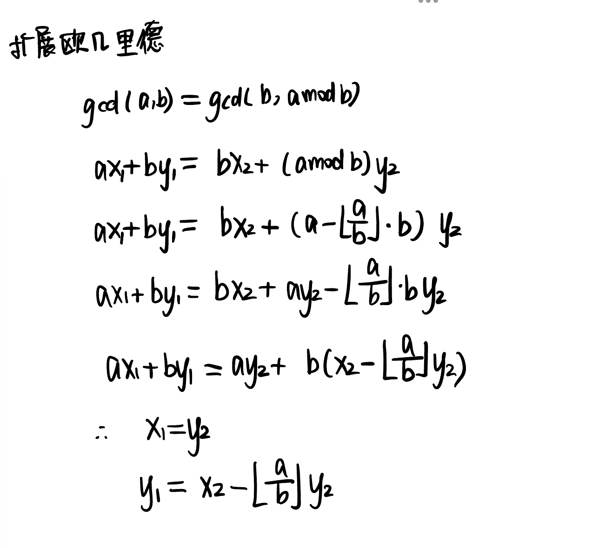

index

- 欧拉函数
- 快速幂
- 扩展欧几里得算法
- 中国剩余定理

欧拉定理：
$$
a与n互质，则\ a^{\phi(n)} \equiv 1(mod\ n)，若n为质数，则\ a^{p-1} = 1(mod\ n)
$$

# 欧拉函数

$$
\Phi(n):1 \sim n中与n互质的数的个数\\
n=p_{1}^{a_{1}}p_{2}^{a_{2}} \dots p_{k}^{a_{k}}\\
\Phi(n)=n(\frac{p_{1} - 1}{p_{1}})(\frac{p_{2} - 1}{p_{2}}) \dots (\frac{p_{k} - 1}{p_{k}})\\
若n为质数，则\phi(n)=n-1
$$

```cpp
int n,m;
int main(){
    cin >> n;
    while(n--){
        int a; 
        cin >> a;
        int res = a;
        // 分解
        for(int i = 2; i <= a/i; i++){
            if(a % i == 0) res = res / i * (i - 1); // fai(n) = N * ((p1 - 1)/p1) * ((p2 - 1)/p2)...
            while(a % i == 0) a /= i;
        }
        if(a > 1) res = res / a * (a - 1); // 自己也是一个因子
        cout << res << endl;
    }
}
```

## 筛法求欧拉函数


```
计算从 1 到 n 的每一个数的欧拉函数，并求和。
```

思路：
- 线性筛出素数（用st标记即可）
- 初始化，phi[1] = 1, phi[p] = p - 1 (p > 2)
- 

```cpp
int primes[N], cnt;
int phi[N];
bool st[N];

ll get_eulers_sum(int n){
    phi[1] = 1; // 初始化
    for(int i = 2; i <= n; i++){
        if(!st[i]){
            primes[cnt++] = i;
            phi[i] = i - 1;
        }
        for(int j = 0; primes[j] <= n / i; j++){
            st[primes[j] * i] = true;
            if(i % primes[j] == 0) { 
                phi[primes[j] * i] = primes[j] * phi[i]; // 待推导
                break;
            }
            phi[primes[j] * i] = phi[i] * (primes[j] - 1);
        }
    }
    ll res = 0;
    for(int i = 1; i <= n; i++) res += phi[i]; // 求和
    return res;
}
```

```cpp
if(i % primes[j] == 0) { 
    phi[primes[j] * i] = primes[j] * phi[i];
    break;
}
```

推导：


# 快速幂 / 欧拉降幂

快速求出$a^k mod\ p$。时间复杂度$O(log{k})$

思路：
$$
\begin{align*}
&1. 求出\ a^{2^0} mod\ p,\ a^{2^1} mod\ p  \dots a^{2^k} mod\ p ,将\ k\ 转为二进制x1x2\dots\\
&2. \ a^k\ =\ a^{2^{x_{1}}}a^{2^{x_{2}}} \dots a^{2^{x_{t}}}\\
\
\end{align*}
$$
while(k != 0)
- 检查k的末位
  - 如果为1，则res *= a
- k右移1位
- a平方

给定 n 组 ai,bi,pi，对于每组数据，求出 $a_{i}^{b_{i}}\mod p_{i}$ 的值。

```cpp
int qmi_fake(int a, int k){
    int res = 1;
    while(k){
        if(k & 1) res *= a;
        k >> 1;
        a *= a;
    }
}

int qmi(int a, int k, int p){
    int res = 1;
    // 求k的二进制
    while(k){
        if(k & 1) res = (ll)res * a % p; // k 的二进制末位为1
        k >>= 1; // 右移
        a = (ll)a * a % p; // k 右移导致的 a 平方
    }
    return res;
}
```

## 求逆元

乘法逆元
> b、m互质，且对于任意整数a，若b|a，则存在一个整数x，使得a/b = ax (mod m)，则称 x 为 b 的模 m 乘法逆元，x = b^-1 (mod m)

$$
\frac{a}{b} = ab^{-1} (mod\ m), x=b^{-1}(mod\ m)\\
即寻找x，使得bx\equiv 1(mod\ m)
$$

```
给定 n 组 ai,pi，其中 pi 是质数，求 ai 模 pi 的乘法逆元 bi
```

当模数为质数时可以用费马小定理求逆元:

$$
(a/b) \mod p = a * b^{p - 2} \mod p
$$
推导：
$$
bx \equiv 1(mod\ p)\\
由于p为质数，由费马小定理得，b^{p-1} \equiv 1(mod\ p)\\
故x = b^{p-2}
$$


# 贝祖定理——扩展欧几里得算法

$$
对任意正整数a、b，一定存在整数s、t，使得sa+tb=gcd(a,b)
$$




```cpp
int ex_gcd(int a, int b, int& x, int& y){
    if(!b) {
        x = 1;
        y = 0;
        return a;
    }
    int d = ex_gcd(b, a % b, x, y);
    int tmp = y; // y2
    y = x - a / b * y; // y1 = x2 - a/b y2
    x = tmp; // x1 = y2
    return d;
}
```

# 中国剩余定理

$$
m_{1},m_{2} \dots m_{k}两两互质，
$$


