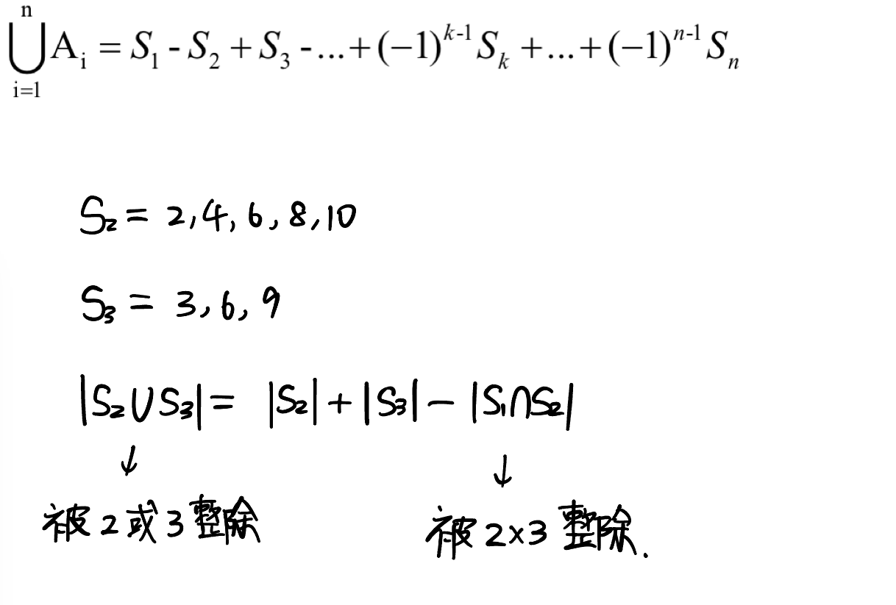

index
- 容斥原理
- 博弈论

# 容斥原理



集合个数：奇数加，偶数减

二进制数的哪一位为1，表示选中

```cpp
i >> k & 1; // 求 i 的第 k 位
```

```
给定一个整数 n 和 m 个不同的质数 p1,p2,…,pm。请你求出 1∼n 中能被 p1,p2,…,pm 中的至少一个数整除的整数有多少个。
```

思路：
1. 


时间复杂度为O(2^m * m)

```cpp
int p[N]; // 质数

int main(){
    cin >> n >> m;
    for(int i = 0; i < m; i++) cin >> p[i];
    
    // 将每个质数看做一个集合，利用位运算来统计所有集合被选的状态 将i用二进制表示 其中1为当前位集合被选 0为没有选 
    int res = 0;
    for(int i = 0; i < 1 << m; i++){
        int t = 1; // 当前所有质数的乘积
        int sum = 0; // 当前选法里有几个集合（i 里面有几位 1）
        
        // 遍历i的所有二进制位
        for(int j = 0; j < m; j++){ // 如果是1 则将t和sum更新
            if(i >> j & 1){ 
                sum++;
                if((ll) t * p[j] > n){ // 如果乘积大于n，说明n不能被这几个集合整除
                    t = -1;
                    break;
                }
                t *= p[j];
            }
        }
        if(t != -1 && t != 1){
            // 容斥原理：奇数加，偶数减
            // 1~n 中能被 t 整除的质数的数量 = n / t
            if(sum % 2) res += n / t;
            else res -= n / t;
        }
    }
    cout << res << endl;
}
```

# 博弈论

NIM

给定几堆石子，两位玩家轮流操作，每次操作可以从任意一堆石子中拿走任意数量的石子（可以拿完，但不能不拿），最后无法进行操作的人视为失败。

必胜状态：比如先手进行某一个操作，留给后手是一个必败状态时，对于先手来说是一个必胜状态，这时也称为先手必胜状态，也就是说先手可以走到一个必败状态留给后手

必败状态：先手无论如何操作，留给后手都是一个必胜状态时，对于先手来说是一个必败状态，先手走不到一个必败状态留给后手


思路：
设石子数为 a1…an
ai全部为 0 时，为无法操作状态，此时异或为0。
令ai的异或为x。若x的二进制表示中最高一位1在第k位，说明a1~an中必然存在一个数ai，ai的第k位是1
而 `ai异或x` < `x`
ai - (ai - （ai异或x）) = ai 异或 x
所以 $a1 \oplus a2 \oplus \dots \oplus ai \oplus x \oplus \dots \oplus an = x \oplus x = 0$
结论：如果所有ai异或起来为1，则为先手必胜，否则必输


```cpp
cin >> n;
int res = 0;
while(n--){
    int x;
    cin >> x;
    res ^= x;
}
if(res) cout << "Yes";
else cout << "No";
```


