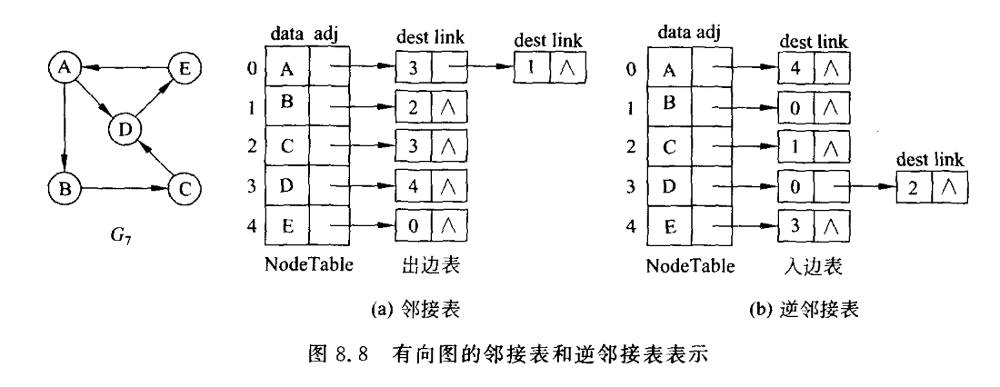
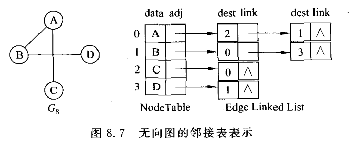

index
- 数据结构
- 图的遍历
  - 宽度优先遍历BFS
  - 深度优先遍历DFS
  - 反向建图+dfs

# 数据结构

- 邻接矩阵
- 邻接表：每个顶点都有一个单链表，存有它所能到达的点。加边：在单链表里加点（通常加到头节点处）
  - 顶点：拥有一个单链表，存放所有它能走到的点
  - 加边：例如添加a->b，就在a的单链表加入b
    对于无向图,只需在[加边]时同时存储a->b、b->a即可。





# 图的遍历

## 宽度优先遍历

模版

```cpp
d[i] : 源点到点 i 的距离
queue <- 1
while queue not empty{
    扩展 对头 的所有邻居x
        if x未遍历
            queue <- x
            d[x] = d[t] + 1
}
```

## 深度优先遍历

一直往下搜，直至最底部，然后回溯，回溯前记得恢复现场

```cpp
int h[N], e[N], ne[N], idx; 
// h[i]: 第i个单链表（的头结点），对应顶点i，存储顶点i可以到达的点的索引。
// e[idx]：存储某条边的终点
// ne[idx]：next指针，存储下一条边的索引
// idx：当前 边 的索引。记录边的数量和索引的位置
bool st[N]; // 存储点的遍历情况

void init(){
    memset(h, -1, sizeof(h)); // 初始化头节点，所有顶点的单链表为空。
}

// e: a->b
void add(int a,int b){
    e[idx] = b; // 边e的终点是b
    ne[idx] = h[a]; // 将idx添加到a的单链表的头结点处，故idx的next指向 a原本的头结点h[a]
    h[a] = idx++; // 更新头结点、idx
}

void dfs(int u){
    st[u] = true; // 点u已经被遍历
    for(int i = h[u]; i != -1; i = ne[i]){ // 遍历u的可达点集
        int j = e[i]; // j 是当前边的终点
        if(!st[j]) dfs(j); // 继续遍历顶点 j
    }
}
```

### 链表实现dfs、bfs

```cpp
struct N{
    int v;
    N* ne;
    N(int v, N* ne = nullptr) : v(v), ne(ne){ }
};

struct G{
    int v;
    N* head = new N(-1); // dummy head
}g[M];
bool st[M];

// 插入时，链表维持升序
void add(int x, int y){
    N* cur = g[x].head;
    while(cur->ne != nullptr && cur->ne->v < y){
        cur = cur->ne;  
    }
    cur->ne = new N(y, cur->ne);
}

void dfs(int u){
    cout << u << ' ';
    st[u] = true;
    for(N* cur = g[u].head->ne; cur != nullptr; cur = cur->ne)
        if(!st[cur->v]) dfs(cur->v);
}

void bfs(int u){
    int q[M], hh = 0, tt = -1;
    cout << u << ' ';
    st[u] = true;
    q[++tt] = u;
    while(hh <= tt){
        int j = q[hh++];
        for(N* cur = g[j].head->ne; cur != nullptr; cur = cur->ne){
            if(!st[cur->v]){
                cout << cur->v << ' ';
                st[cur->v] = true;
                q[++tt] = cur->v;
            }
        }
    }
}

int main(){
    int n,m,x,y;
    cin>>n>>m;
    while(m--){
        cin>>x>>y;
        add(x, y);
    }
    dfs(1);  
    cout << endl;
    memset(st, 0, sizeof st);
    bfs(1);
}
```


## 反向建图+dfs

problem: 给出 $N$ 个点，$M$ 条边的有向图，对于每个点 $v$，求 $A(v)$ 表示从点 $v$ 出发，能到达的编号最大的点。

```cpp
int g[N], e[N], ne[N], idx = 0;
int maxi[N]; // max[i]表示点 i 能到达的最大的点
int st[N];

void add(int u, int v){
    e[idx] = v;
    ne[idx] = g[u];
    g[u] = idx;
    idx++;
}

void dfs(int v){
    if(st[v]) return;
    st[v] = 1;
    maxi[v] = max(maxi[v], v);
    for(int i = g[v]; i != -1; i = ne[i]){
        int j = e[i];
        maxi[j] = max(maxi[j], maxi[v]);
        dfs(j);
    }
}

int main(){
    memset(g, -1, sizeof g);
    int m, n;
    cin>>m>>n;
    while(n--){
        int u, v;
        cin >> u >> v;
        // 反向建图
        add(v, u);
    }
    memset(maxi, -1, sizeof maxi);
    for(int i = m; i >= 1; i--) dfs(i);
    for(int i = 1; i <= m; i++) cout << maxi[i] << ' ';
}

```


