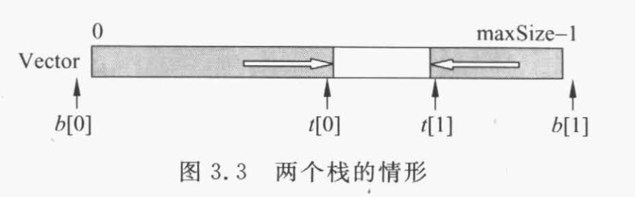

# 栈和队列

## 顺序栈


## 双向栈

栈0: 栈底为-1，栈顶为t[0]
栈1: 栈底为maxSize，栈顶为t[1]

栈0、1的栈顶相遇后，溢出



```cpp
bool push(DualStack& DS, T x, int d){
    // 插入元素x。d = O,插在栈0；d = 1, 插在栈1
    if(DS.t[0] + 1 == DS.t[1]) return false;
    if(d == 0) DS.t[0]++;
    else DS.t[1]--;
    DS.Vector[DS.t[d]] = x;
    return true;
}

bool pop(DualStack& DS, T x, int d){
    if(DS.t[i] == DS.b[i]) return false;
    x = DS.Vector[DS.t[i]];
    if(d == 0) DS.t[0]--;
    else DS.t[1]++;
    return true;
}
```

## 链式栈

栈的链表实现。栈顶在list的表头。

```cpp
template<class T>
class LinkedStack <T>{
public:

private:
    LinkNode<T> *top;
}
template <class T> LinkedStack<T>::makeEmpty() {
    LinkNode<T>* cur;
    while(top!=nullptr){
        cur = top;
        top = top->link;
        delete cur;
    }
}
// 插在表头
template <class T> void LinkedStack<T>::Push(const T & x){
    top = new LinkNode<T>(x, top);
    assert(top != nullptr);
}

template <class T> bool LinkedStack<T>::Pop(T& x){
    if(isEmpty() == true) return false;
    LinkNode<T> *p = top;
    top = top->link;
    x = p->data;
    delete p;
    return true;
}

```

## 表达式计算

[label](linear_tables/stack/notations.md)


