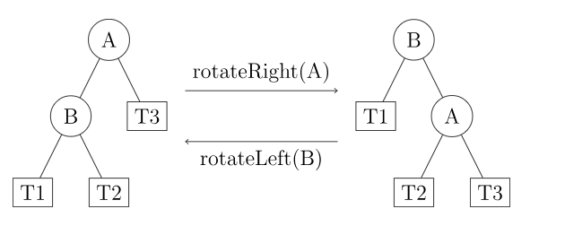

# 平衡树

> 每个结点的左子树和右子树高度差最多为 1 的BST

平衡因子：左子树高度 - 右子树高度

- `Splay 树` 中，对于任意节点的访问操作（搜索、插入还是删除），都会将被访问的节点移动到树的根节点位置。
- `AVL 树` 每个节点 N 维护以 N 为根节点的树的高度信息。AVL 树对平衡性的定义：如果 T 是一棵 AVL 树，当且仅当左右子树也是 AVL 树，且 $|height(T->left) - height(T->right)| \leq 1$
- `Size Balanced Tree` 每个节点 N 维护以 N 为根节点的树中节点个数 size。对平衡性的定义：任意节点的 size 不小于其兄弟节点（Sibling）的所有子节点（Nephew）的 size。
- `B 树` 对平衡性的定义：每个节点应该保持在一个预定义的范围内的关键字数量。


如何调整至平衡状态：

对结点A进行：
- 左旋(left rotate/zag/RR平衡旋转): 将A向左下旋转，将A的右子节点B向右上旋转，此时B成为root，再将B的左子树变成A的右子树
- 右旋(right rotate/zig/LL平衡旋转)：将A向右下旋转，将A的左子结点B向左上旋转，此时B成为root，再将B的右子树变成A的左子树



```cpp
void updateHeight(T* root){
//...
}

// 调用时需要保存 root 的父节点 pre。方法返回指向新的根节点的指针，只需要将 pre 指向新的根节点即可。
T* leftRotate(T* root){
    T* B = root->r;
    root->r = B->l;
    B->l = root;
    updateHeight(root);
    updateHeight(B);
    return B;
}
T* rightRotate(T* root){
    T* B = root->l;
    root->l = B->r;
    B->r = root;
    updateHeight(root);
    updateHeight(B);
    return B;
}
```

平衡性被破坏的情况：
1. LL型：rt的左孩子的左子树过长。solution：右旋rt
2. RR型：rt的右孩子的右子树过长。solution：左旋rt
3. LR型：rt的左孩子的右子树过长。solution：先左旋rt的左子结点，再右旋rt
4. RL型：rt的右孩子的左子树过长。solution：先右旋rt的右子结点，再左旋rt


