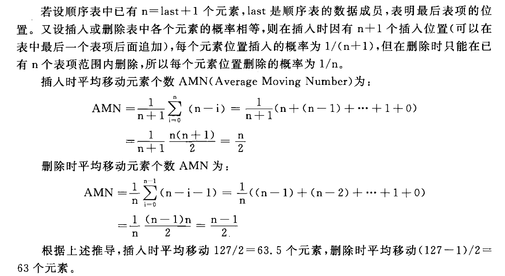

2.2 线性表可用顺序表或链表存储。试问：

(1)两种存储表示各有哪些主要优缺点？

顺序表：

- 优点：存取快，可以直接存取。空间利用率高
- 缺点：删除、添加元素缓慢。使用静态存储结构时可能溢出

链表：

- 优点：删除、添加元素快。没有溢出问题
- 缺点：存取慢，只能顺序访问。空间利用率低

(2)如果有n个表同时并存，并且在处理过程中各表的长度会动态发生变化，表的总数也可能自动改变，在此情况下，应选用哪种存储表示？为什么？

链表。创建新链表、删除链表较为方便，插入、删除元素也快捷。

(3)若表的总数基本稳定，且很少进行插入和删除，但要求以最快的速度存取表中的元素，这时，应采用哪种存储表示？为什么？

顺序表。按照固定顺序存放在内存，每个元素有下标对应

2.3 顺序表的插入和删除要求仍然保持各个元素原来的次序。设在等概率情形下，对有127个元素的顺序表进行插入，平均需要移动多少个元素？删除一个元素，又平均需要移动多少个元素？

