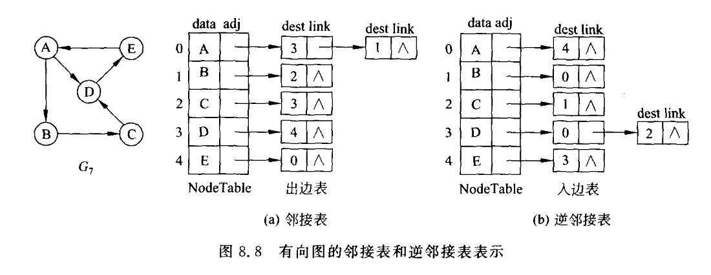
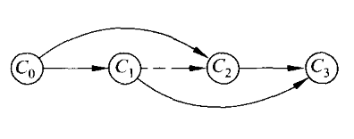

index
- DFS
- BFS
- 树和图的遍历 
  - 有向图
  - 树：无环有向图 
  - 深度优先遍历在树中的应用 
  - 宽度优先遍历在图中的应用
- 拓扑排序

# DFS

深度优先。搜索到最底部时才回溯，并确保每条路都搜过

数据结构：stack

空间：O(h) h：层数

回溯、剪枝

## 全排列

```
给定一个整数 n，将数字 1∼n 排成一排，按照字典序将所有的排列方法输出。
```

```cpp
const int N = 8;

int n;
int path[N]; // 存储数字序列
bool st[N]; // status, 表示数字 i 已经被用过了

void dfs(int u){
    if(u == n) { // 到达最底部（已经形成完整的序列）
        for(int i = 0; i < n; i++) cout << path[i] << endl;
        return;
    }
    for(int i = 1; i <= n; i++){
        if(!st[i]){
            path[u] = i;
            st[i] = true; // 标记：数字 i 已经被用过
            dfs(u + 1); // 继续深入
            st[i] = false; // 恢复现场!
        }
    }
}
int main(){
    cin >> n;
    dfs(0);
}
```

## 八皇后

法1: 利用“每行只能有一个皇后”这一推断

```cpp
#include <algorithm>
#include <memory.h>
using namespace std;

const int N = 20;

int n;
char g[N][N]; // 存储棋盘状态
bool co[N], dg[N], udg[N]; // co: 同一行、列 dg：同一对角线  udg：同一反对角线

void dfs(int u){
    if(u == n) {
        for(int i = 0; i < n; i++) cout << g[i] << endl;
        cout << endl;
        return;
    }
    for(int i = 0; i < n; i++){
        if(!co[i] && !dg[u + i] && !udg[n - u + i]){
            g[u][i] = 'Q';
            co[i] = dg[u + i] = udg[n - u + i] = true;
            dfs(u + 1); // 继续深入
            co[i] = dg[u + i] = udg[n - u + i] = false; // 恢复现场 
            g[u][i] = '.'; // 恢复现场 
        }
    }
}  

int main(){
    cin >> n;
    for(int i = 0; i < n; i++)
        for(int j = 0; j < n; j++)
            g[i][j] = '.';
    dfs(0);
}
```

法2:

```cpp
int n;
char g[N][N]; // 存储棋盘状态
bool row[N], col[N], dg[N], udg[N]; // co: 同一行、列 dg：同一正对角线  udg：同一反对角线

void dfs(int x, int y, int s){ // x：行 y：列 s：已经放了几个皇后
    if(y == n) y = 0, x++;
    if(x == n){
        if(s == n) {
            for(int i = 0; i < n; i++) cout << g[i]<< endl;
            cout << endl;
        }
        return;
    }
    dfs(x, y + 1, s); // 不放皇后
    // 放皇后
    if(!row[x] && !col[y] && !dg[x + y] && !udg[x - y + n]){
        g[x][y] = 'Q';
        row[x] = col[y] = dg[x + y] = udg[x - y + n] = true;
        dfs(x, y + 1, s + 1);
        row[x] = col[y] = dg[x + y] = udg[x - y + n] = false;
        g[x][y] = '.';
    }
}
```

# BFS

广度优先。一层一层地搜

数据结构：queue
空间：O(2^h)
特点：最短路

1. 把起始点放入 queue
2. 重复下述2步骤，直到 queue 为空为止：
- 取出队头；
- 找出与此点 邻接的 且 尚未遍历 的点，进行标记，然后全部放入queue中。


```
给定一个 n×m 的二维整数数组，用来表示一个迷宫，数组中只包含 0 或 1，其中 0 表示可以走的路，1 表示不可通过的墙壁。最初，有一个人位于左上角 (1,1) 处，已知该人每次可以向上、下、左、右任意一个方向移动一个位置。请问，该人从左上角移动至右下角 (n,m) 处，至少需要移动多少次。
```

```cpp
int n, m;
int g[N][N]; // 地图
int d[N][N]; // 每个点到起点的距离, 即移动到点(i, j)需要的步数
pii q[N * N]; // 路线
pii Prev[N][N]; // 记录前一个点

int bfs(){
    int hh = 0, tt = 0;
    q[0] = {0, 0};
    memset(d, -1, sizeof(d));
    d[0][0] = 0;
    int dx[4] = {-1,0,1,0}, dy[4] = {0, 1, 0, -1}; // 向量
    while(hh <= tt){
        auto t = q[hh++]; // 取出对头
        for(int i = 0; i < 4; i++){ // 尝试向4个方向行走
            int x = t.first + dx[i], y = t.second + dy[i];
            if(x >= 0 && x < n && y >= 0 && y < m && g[x][y] == 0 && d[x][y] == -1){ // boarder judge
                d[x][y] = d[t.first][t.second] + 1; // 标记
                Prev[x][y] = t; // 为了能够打印出路线，记录(x, y) 的前一个点。这样可以形成一棵树
                q[++tt] = {x, y}; // 放入队列
            }
        }
    }
    // 输出路径
    int x = n - 1, y = m - 1;
    while (x || y)
    {
        cout << x << ' ' << y << endl;
        auto t = Prev[x][y];
        x = t.first, y = t.second;
    }
  
    return d[n-1][m-1]; // 终点
}
```

# 树和图的遍历

## 有向图

数据结构：

- 邻接矩阵
- 邻接表：每个顶点都有一个单链表，存有它所能到达的点。加边：在单链表里加点（通常加到头节点处）
  - 顶点：拥有一个单链表，存放所有它能走到的点
  - 加边：例如添加a->b，就在a的单链表加入b
对于无向图,只需在[加边]时同时存储a->b、b->a即可。




1. 深度优先遍历：一直往下搜，直至最底部，然后回溯，回溯前记得恢复现场

```cpp
int h[N], e[N], ne[N], idx; 
// h[i]: 第i个单链表（的头结点），对应顶点i，存储顶点i可以到达的点的索引。
// e[idx]：存储某条边的终点
// ne[idx]：next指针，存储下一条边的索引
// idx：当前 边 的索引。记录边的数量和索引的位置
bool st[N]; // 存储点的遍历情况

void init(){
    memset(h, -1, sizeof(h)); // 初始化头节点，所有顶点的单链表为空。
}

// e: a->b
void add(int a,int b){
    e[idx] = b; // 边e的终点是b
    ne[idx] = h[a]; // 将idx添加到a的单链表的头结点处，故idx的next指向 a原本的头结点h[a]
    h[a] = idx++; // 更新头结点、idx
}

void dfs(int u){
    st[u] = true; // 点u已经被遍历
    for(int i = h[u]; i != -1; i = ne[i]){ // 遍历u的可达点集
        int j = e[i]; // j 是当前边的终点
        if(!st[j]) dfs(j); // 继续遍历顶点 j
    }
}
```

## 树：无环有向图

$$
O(n+m)，n：顶点数 \qquad m：边数
$$

## 深度优先遍历在树中的应用

### 树的重心

定义：使得删去它后剩余子树大小的最大值最小的点

- 删除一个顶点，会使得树变成若干子树。统计子树的大小，记录下最大值max。
- 遍历所有顶点并进行上述操作，看哪个顶点能使得max最小（子树之间差异不大，比较平衡），则为重心。

```
给定一颗树，树中包含 n 个结点（编号 1∼n）和 n−1 条无向边。请你找到树的重心，并输出将重心删除后，剩余各个连通块中点数的最大值。

重心定义：重心是指树中的一个结点，如果将这个点删除后，剩余各个连通块中点数的 最大值 最小，那么这个节点被称为树的重心。

输入: 第一行包含整数 n，表示树的结点数。接下来 n−1 行，每行包含两个整数 a 和 b
，表示点 a 和点 b 之间存在一条边。

输出：输出一个整数 m，表示将重心删除后，剩余各个连通块中点数的最大值。
```

思路：不太明白....

1. dfs求出树中每个子树的大小
2. 记录**向下**的子树的最大大小
3. **向上**的子树大小 = 总大小 - **向下**的子树大小

```cpp
int n;
const int N = 100010, M = 200020;
int h[N], e[M], ne[M], idx; // 图
bool st[N]; // 点是否已经被遍历
int ans = N;

void add(int a, int b){
    e[idx] = b;ne[idx] = h[a];h[a] = idx++;
}

// 返回以 u 为根的子树的大小
int dfs(int u){
    st[u] = true;
    int sum = 0; // 当前子树的大小（不包含u）
    int sz = 0; // 删除重心后，连通块大小的最大值
    for(int i = h[u]; i != -1; i = ne[i]){
        // 找剩余连通块中 点数的最大值（剩余子树的大小的最大值）
        int j = e[i];
        if(!st[j]) {
            int son = dfs(j);
            sz = max(sz, son);
            sum += son;
        }
    }
    sz = max(sz, n - sum - 1);
    ans = min(ans, sz);
    return sum + 1; // 记得把u加上
}

int main(){
    cin >> n;
    memset(h , -1, sizeof h);
    for(int i = 0; i < n; i++){
        int a, b;
        cin >> a>>b;
        add(a, b), add(b, a);
    }
    dfs(1);
    cout << ans;
}
```

## 宽度优先遍历在图中的应用

模版

```cpp
d[i] : 源点到点 i 的距离
queue <- 1
while queue not empty{
    扩展 对头 的所有邻居x
        if x未遍历
            queue <- x
            d[x] = d[t] + 1
}
```

单源有向图的最短路问题（有源点）

```
图：点n 边m，可能有重边、自环
求出 1 号点到 n 号点的最短距离
```

```cpp
const int N = 100010, M = 1e6 * 2;
int n,m;
int h[N], e[M], ne[M], idx;
int q[N];
int d[N];
bool st[N];
void add(int a, int b){
    e[idx]=b;ne[idx]=h[a];h[a]=idx++;
}

int bfs(){
    // 初始化
    int hh = 0, tt = 0;
    q[tt] = 1;
    d[1] = 0;
  
    while(hh <= tt){
        int t = q[hh++];
        for(int i = h[t]; i != -1; i = ne[i]){
            int j = e[i];
            if(d[j] == -1){ // j未被遍历
                q[++tt] = j;
                d[j] = d[t] + 1;
            }
        }
    }
    return d[n];
}

int main(){
    cin >> n >> m;
    memset(h,-1,sizeof h);
    memset(d,-1,sizeof d);
    while(m--){
        int a,b;
        cin>>a>>b;
        add(a,b);
    }
    int t = bfs();
    cout << t;
}
```

# 拓扑排序


> AOV网络(activity on vertices): 用有向图表示一个工程，顶点为活动，有向边a->b表示活动a必须先于活动b进行。

> 在有向无环图中，将图中的顶点以线性方式进行排序，使得对于任何有向边 u->v 都可以有u在v的前面

检测有向环即为对AOV网络构造它的拓扑有序序列。

依赖：如果有 `i->j`，则 j 依赖于 i（i 是 j 的前置条件）
间接依赖：如果 i 到 j 有路径（i可达j），则 j 间接依赖于 i。

拓扑排序的目标是将所有节点排序，使得排在前面的节点不能依赖于排在后面的节点。



1. 在AOV网络中选一个没有直接前驱的顶点，并输出之
2. 从图中删去该顶点，同时删去所有它发出的有向边

**入度为0**的点可以作为起点。有向**无环**图至少存在一个入度为 0 的点

思路：不断构造入度为 0 的点。

1. 初始化队列：所有入度为0的点入队
2. 弹出对头t：枚举 t 的所有出边，并删除边 t->j（只需将 j 的入度-1）
3. 如果 j 的入度为0，就入队
4. 入队次数达到n - 1时，队列即为最终的拓扑排序；如果次数不到n-1，说明还剩一些点，这些点都有直接前驱，说明一定存在有向环，拓扑序列不存在。

```
d[i]：i的入度
queue <- 所有入度为0的点
while queue not empty{
    枚举 对头t 的所有出边 t->j
        删除 t->j (d[j]--)
        if d[j] == 0
            queue <- j
}
```

```cpp
int h[N], e[M], ne[M], idx; // 有向图
int d[N], q[N]; // 入度、队列
int n, m;

void add(int a, int b){ // 加边
    e[idx] = b;
    ne[idx] = h[a];
    h[a] = idx++;
}

bool topsort(){
    int hh = 0, tt = -1;
    for(int i = 1; i <= n; i++){
        if(!d[i]) q[++tt] = i;
    }
    while(hh <= tt){
        int t = q[hh++];
        for(int i = h[t]; i != -1; i = ne[i]){
            int j = e[i];
            d[j]--;
            if(d[j] == 0) q[++tt] = j;
        }
    }
    return tt == n - 1;
}

int main(){
    cin >> n >> m;
    memset(h, -1, sizeof(h));
    for(int i = 0; i < m; i++){
        int a, b;
        cin >> a >> b;
        add(a,b); // 无向图
        d[b]++; // 入度增加
    }
    if(topsort()){
        for(int i = 0; i < n; i++) cout << q[i] << " ";
    }
    else cout << -1;
}
```
