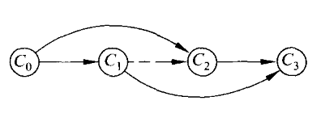

# 拓扑排序
- 拓扑排序的实现
- 关键路径
- DAG的所有拓扑排序

## 拓扑排序的实现

> AOV网络(activity on vertices): 用有向图表示一个工程，顶点为活动，有向边a->b表示活动a必须先于活动b进行。

> 在有向无环图中，将图中的顶点以线性方式进行排序，使得对于任何有向边 u->v 都可以有u在v的前面

检测有向环即为对AOV网络构造它的拓扑有序序列。

依赖：如果有 `i->j`，则 j 依赖于 i（i 是 j 的前置条件）
间接依赖：如果 i 到 j 有路径（i可达j），则 j 间接依赖于 i。

拓扑排序的目标是将所有节点排序，使得排在前面的节点不能依赖于排在后面的节点。



1. 在AOV网络中选一个没有直接前驱的顶点，并输出之
2. 从图中删去该顶点，同时删去所有它发出的有向边

**入度为0**的点可以作为起点。有向**无环**图至少存在一个入度为 0 的点

思路：不断构造入度为 0 的点。这是一个不断割边的过程，边割完后入度为0，也就没有了前置条件，可以加入队列。

1. 初始化队列：所有入度为0的点入队
2. 弹出对头t：枚举 t 的所有出边，并删除边 t->j（只需将 j 的入度-1）
3. 如果 j 的入度为0，就入队
4. 入队次数达到n - 1时，队列即为最终的拓扑排序；如果次数不到n-1，说明还剩一些点，这些点都有直接前驱，说明一定存在有向环，拓扑序列不存在。

```
d[i]：i的入度
queue <- 所有入度为0的点
while queue not empty{
    枚举 对头t 的所有出边 t->j
        删除 t->j (d[j]--)
        if d[j] == 0
            queue <- j
}
```

```cpp
int h[N], e[M], ne[M], idx; // 有向图
int d[N], q[N]; // 入度、队列
int n, m;

void add(int a, int b){ // 加边
    e[idx] = b;
    ne[idx] = h[a];
    h[a] = idx++;
}

bool topsort(){
    int hh = 0, tt = -1;
    for(int i = 1; i <= n; i++){
        if(!d[i]) q[++tt] = i;
    }
    while(hh <= tt){
        int t = q[hh++];
        for(int i = h[t]; i != -1; i = ne[i]){
            int j = e[i];
            d[j]--;
            if(d[j] == 0) q[++tt] = j;
        }
    }
    return tt == n - 1;
}

int main(){
    cin >> n >> m;
    memset(h, -1, sizeof(h));
    for(int i = 0; i < m; i++){
        int a, b;
        cin >> a >> b;
        add(a,b); // 无向图
        d[b]++; // 入度增加
    }
    if(topsort()){
        for(int i = 0; i < n; i++) cout << q[i] << " ";
    }
    else cout << -1;
}
```


## 关键路径

- AOE(Activity On Edge Network)：边表示活动。是一个带权的有向无环图，顶点表示事件，边表示活动持续的时间。
- 关键路径：源点到汇点之间**权值最大**的一条路径。AOE的活动可以并行，则完成整个工程的最短时间是从开始点到完成点的**最长**活动路径长度，即为关键路径。(想想木桶效应，一个水桶能装的最多的水，是由最短的木板决定的。最短、最长都意味着最坏)

AOE相关概念：

- 活动：边。边的权值表示时间
- 事件：点
- 事件的最早发生时间etv：初始点到该点的关键路径长度
- 事件的最迟发生时间ltv：不推迟工期最晚能容忍的发生时间。它的所有后继活动的最迟发生时间的最小值
- 活动的最早开工时间ete：边的最早发生时间，等于其前驱事件的最早发生时间
- 活动的最晚开工时间lte：不推迟工期的最晚开工时间，等于其后继事件的最迟发生时间 - 该事件的持续时间（权值）


求DAG最大权重路径：

- 针对图中的每一个点，遍历它的所有邻居，并更新邻居的dis：如果从我这走能使得距离更远，就把你的dis换成我的dis+时间。
- 最后，由于走到汇点后没有加上时间，记得加上。

```cpp
int maxDis(){
    for(int i = 1; i <= n; i++){ // 遍历所有点
        for(int j = h[i]; j != -1; j = ne[j]){ // 遍历i的所有邻居
            int k = e[j];
            dis[k] = max(dis[k], dis[i] + tm[i]); // 更新
        }
    }
    int res = 0;
    // 找出所有出度为0（汇点）的点，加上自己的时间，并求出他们中的最大值
    for(int i = 1; i <= n; i++){
        if(p[i] == 0){ 
            dis[i] += tm[i];
            res = max(dis[i], res);
        }
    }
    return res;
}
```


### 递推求最早和最迟发生时间


## DAG的所有拓扑排序

暴力：建图，从入度为0的点开始dfs，终止条件为出度为0的点，数量++。TLE警告！

```cpp
int cnt = 0;
void dfs(int u){
    if(p[u] == 0){
        cnt = cnt + 1 % MOD;
        return;
    }
    for(int i = h[u]; i != -1; i = ne[i]) dfs(e[i]);
}
```

dp法：

- 基础流程为拓扑排序
- 额外引入数组，更新每一个点的答案：当一个点被删去时，将它的答案加到它的(出边)邻接点上。


```cpp
int h[N], e[N], ne[N], idx = 0, d[N], p[N], ans[N];
// d: 入度  p：出度
void add(int a, int b){
    e[idx] = b;ne[idx] = h[a];h[a] = idx++;
    p[a]++; d[b]++;
}

int topsort(int n){
    int q[N], hh = 0, tt = -1;
    for(int i = 1; i <= n; i++)
        if(d[i] == 0) { // 入度为0的点入队，答案为1
            q[++tt] = i;
            ans[i] = 1;
        }
    while(hh <= tt){
        int t = q[hh++];
        for(int i = h[t]; i != -1; i = ne[i]){
            int j = e[i];
            // 更新 t 的邻居点 j 的答案
            ans[j] = (ans[j] + ans[t]) % MOD;
            d[j]--;
            if(d[j] <= 0){
                q[++tt] = j;
            }
        }
    }
    for(int i = 1; i <= n; i++){
      if(p[i] == 0){ // 出度为0的点
          res = (res + ans[i]) % MOD;
      }
    }
    return res;
}
```
