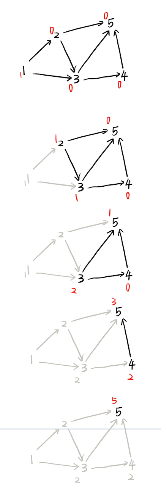

# 拓扑排序

- 关键路径
- DAG的所有拓扑排序


# 拓扑排序

## 关键路径

- AOE(Activity On Edge Network)：边表示活动。是一个带权的有向无环图，顶点表示事件，边表示活动持续的时间。
- 关键路径：AOE的活动若可以并行，则完成整个工程的最短时间是从开始点到完成点的**最长**活动路径长度，即为关键路径。(想想木桶效应，一个水桶能装的最多的水，是由最短的木板决定的。最短、最长都意味着最坏)

AOE相关概念：

- 活动：边。边的权值表示时间
- 事件的最早发生时间：初始点到该点的关键路径长度
  - 最迟发生时间：


求DAG最大权重路径：
- 求出拓扑排序
- 用数组记录每个点到源点到距离，按照拓扑排序来更新每个点


### 递推求最早和最迟发生时间

## DAG的所有拓扑排序

暴力：建图，从入度为0的点开始dfs，终止条件为出度为0的点，数量++。TLE警告！

```cpp
int cnt = 0;
void dfs(int u){
    if(p[u] == 0){
        cnt = cnt + 1 % MOD;
        return;
    }
    for(int i = h[u]; i != -1; i = ne[i]) dfs(e[i]);
}
```

dp法：
- 基础流程为拓扑排序
- 额外引入数组，更新每一个点的答案：当一个点被删去时，将它的答案加到它的(出边)邻接点上。



```cpp
int h[N], e[N], ne[N], idx = 0, d[N], p[N], ans[N];
// d: 入度  p：出度
void add(int a, int b){
    e[idx] = b;ne[idx] = h[a];h[a] = idx++;
    p[a]++; d[b]++;
}

int topsort(int n){
    int q[N], hh = 0, tt = -1;
    for(int i = 1; i <= n; i++)
        if(d[i] == 0) { // 入度为0的点入队，答案为1
            q[++tt] = i;
            ans[i] = 1;
        }
    while(hh <= tt){
        int t = q[hh++];
        for(int i = h[t]; i != -1; i = ne[i]){
            int j = e[i];
            // 更新 t 的邻居点 j 的答案
            ans[j] = (ans[j] + ans[t]) % MOD;
            d[j]--;
            if(d[j] <= 0){
                q[++tt] = j;
            }
        }
    }
    for(int i = 1; i <= n; i++){
      if(p[i] == 0){ // 出度为0的点
          res = (res + ans[i]) % MOD;
      }
    }
    return res;
}
```


