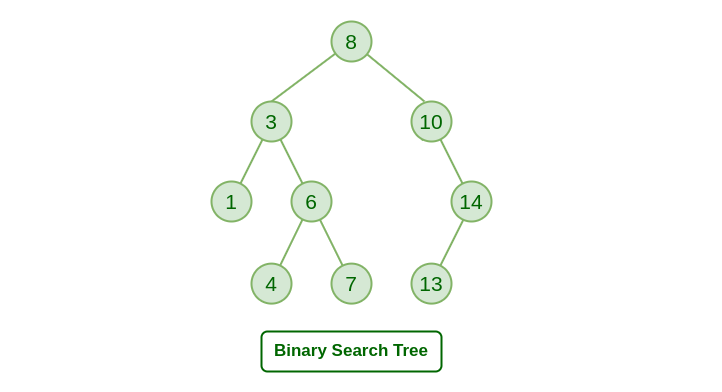

index

- binary searching tree
  - 
- balance tree

# binary searching tree(BST)



性质：

- 左子树上所有点的值小于其根节点
- 右子树上所有点的值大于其根节点
- 空树是bst。bst的左右子树也是bst
- 操作的时间复杂度：最优O(logn) 最差O(n)
- BST的中序遍历输出的序列是升序序列

```cpp
// 二叉搜索树
struct T{
    int e;
    T* l;
    T* r;
    int sz; // 当前节点为根的子树大小
    int cnt; // 当前节点的重复数量
    T(int val) : e(val), sz(1), cnt(1), l(nullptr), r(nullptr) { }
};

void traverse(T* root){ // 遍历
    if(root==nullptr) return;
    traverse(root->l);
    cout << root->e;
    traverse(root->r);
}

// 返回最大、最小值: 位于最右边、最左边
int findMin(T* root){
    if(root == nullptr) return -1;
    while(root->l != nullptr) root = root->l;
    return root->e;
}
int findMax(T*root){
    if(root == nullptr) return -1;
    while(root->r != nullptr) root = root->r;
    return root->e;
}

// 返回最大值的节点
T* findMaxNode(T*root){
    if(root == nullptr) return nullptr;
    while(root->r != nullptr) root=root->r;
    return root;
}

// 搜索
T* find(T* r, int e){
    if(r == nullptr) return nullptr;
    if(r->e > e) find(r->l, e);
    else if(r->e < e) find(r->r, e);
    else return r;
}

// 插入一个节点
T* add(T* root, int e){
    T* newT = new T(e);
    if(root == nullptr) return newT;
    if(root->e > e){
        root->l = add(root->l, e);
    }
    else if(root->e < e){
        root->r = add(root->r, e);
    }
    else{ // 重复的  
        root->cnt++;
    }
    // 更新节点的子树大小??
    if(root->l != nullptr) root->sz = root->cnt + root->l->sz;
    if(root->r != nullptr) root->sz = root->cnt + root->r->sz;
    return root;
}

// root = remove(root, 1)
T* remove(T* root, int e){
    if(root == nullptr){return nullptr;}
    else if(e < root->e){
        root = remove(root->l, e);
    }else if(e > root->e){
        root = remove(root->r, e);
    }else{
        if(root->cnt > 1) root->cnt--;
        else{
            if(root->l == nullptr){
                T* tmp = root->r;
                delete root;
                return tmp;
            } else if(root->r == nullptr){
                T* tmp = root->l;
                delete root;
                return tmp;
            } else{ // 用左子树的最右节点(最大值)代替要删去的节点
                T* maxNode = findMaxNode(root->l);
                root->e=maxNode->e; root->cnt=maxNode->cnt;
                // 删去原先的最右节点
                maxNode->cnt = 1;
                root->l = remove(root->r, maxNode->e);
            }
        }
    }
    return root;
}

// 名次：将数组元素升序排序后第一个相同元素之前的数的个数加一。
int queryRank(T*root, int e){
    int rk = 0;
// TODO
    return rk;
}

// 查找排名为 k 的元素
int queryKth(T* root, int k){
// TODO
}

```


P5076待调整!!!!!卡了我两天了

```cpp

// BST
// 注意：特判 特判 特判！t[ & ] 的 & 是不是等于-1！

int idx = -1;
struct T{
    int x;
    int l = -1;
    int r = -1;
    int cnt; // 出现次数
    int sz = 0; // 子树大小(包括自己)
} t[N];


int add(int rt, int e){
    if(rt == -1) { 
        idx++; 
        t[idx].l = t[idx].r = -1; 
        t[idx].x = e; 
        t[idx].sz = 1; // 初始化大小为1
        t[idx].cnt = 1; // 初始化计数为1
        return idx; 
    }
    t[rt].sz++; // //如果查到这个节点，说明这个节点的子树里面肯定有v
    if(e < t[rt].x) {
        t[rt].l = add(t[rt].l, e); 
    }
    else if(e > t[rt].x) {
        t[rt].r = add(t[rt].r, e); 
    }else{
        t[rt].cnt++; // 重复出现
    }
    return rt; // !!!!
}

int findMaxNode(int rt){ // 返回最大结点的下标
    if(rt == -1) return -1;
    while(t[rt].r != -1) rt = t[rt].r;
    return rt;
}

int findMinNode(int rt){ // 返回最小结点的下标
    if(rt == -1) return -1;
    while(t[rt].l != -1) rt = t[rt].l;
    return rt;
}

int fd(int rt, int e){ // 返回值为e的结点的下标
    if(rt == -1) return -1;
    if(e < t[rt].x) return fd(t[rt].l, e); // 递归调用需要返回值!!!!!
    else if(e > t[rt].x) return fd(t[rt].r, e);
    else return rt;
}

// 找x的父节点，返回下标
int findFather(int rt = 0, int x = 0, int pre = -1){
    if(rt == -1) return -1;
    if(x < t[rt].x) return findFather(t[rt].l, x, rt);
    else if(x > t[rt].x) return findFather(t[rt].r, x, rt);
    else return pre;
}

/*
如果x为左节点：rk = 左子树大小
右：rk = 父节点的左子树大小 + 左子树大小
*/
int ranking(int rt, int x){ // 集合中小于 x 的数的个数 +1。
    if(rt == -1) return 0;
    if(x < t[rt].x) return ranking(t[rt].l, x);
    else if(x > t[rt].x) {
        if(t[rt].l == -1) return ranking(t[rt].r, x) + 1;
        else return ranking(t[rt].r, x) + t[t[rt].l].sz + 1;
    }
    else {
        if(t[rt].l == -1) return 1;
        else return t[t[rt].l].sz + 1;
    }
}

int ans = 0;
void queryRkX(int rt, int& k){ // 查询 排名为 k 的结点的值
    if(rt == -1) return;
    queryRkX(t[rt].l, k);
    k--;
    if(k == 0) ans = t[rt].x; 
    queryRkX(t[rt].r, k);
}

/*
如果节点有左子树：
前驱节点就是该左子树中最大值的节点（即左子树中最右的节点）。
如果节点没有左子树：
需要从该节点开始向上追溯其父节点，直到找到第一个比该节点小的祖先节点。这个祖先节点就是前驱节点。
*/

int queryPrex(int rt, int x, int ans){// 求x的前驱：小于x，且最大的数
    int idx = fd(rt, x);
    if(idx == -1) return -2147483647;
    if(t[idx].l != -1){
        return t[findMaxNode(t[idx].l)].x;
    }else{
        int father = findFather(rt, x, -1);
        while(father != -1){
            if(t[father].x < x) return t[father].x;
            father = findFather(rt, t[father].x, -1);
        }
        return -2147483647;
    }
}

int queryPost(int rt, int x){ // 求x的后继：大于x，且最小的数
    // 有右结点：右结点子树的最小值
    // 无：第一个大于x的父节点
    int idx = fd(rt, x);
    if(idx == -1) return 2147483647;
    if(t[idx].r == -1) {
        int father = findFather(rt, x, -1);
        while(father != -1){
            if(t[father].x > x) return t[father].x;
            father = findFather(rt, t[father].x, -1);
        }
        return 2147483647;
    }else{
        return t[findMinNode(t[idx].r)].x;
    }
}

int main(){
    int q, op, x;
    cin >> q;
    int rt = -1;
    while(q--){
        cin >> op >> x;
        switch(op){
            case 1:{
                cout << ranking(rt, x) << endl;
                break;
            }
            case 2:{
                ans = 0;
                queryRkX(rt, x);
                cout << ans << endl;
                break;
            }
            case 3:{ // 求x的前驱：小于x，且最大的数
                cout << queryPrex(rt, x, -2147483647) << endl;
                break;
            }
            case 4:{ // 求x的后继：大于x，且最小的数
                cout << queryPost(rt, x) << endl;
                break;
            }
            case 5:{
                rt = add(rt, x);
                break;
            }
        }
    }
}
```
