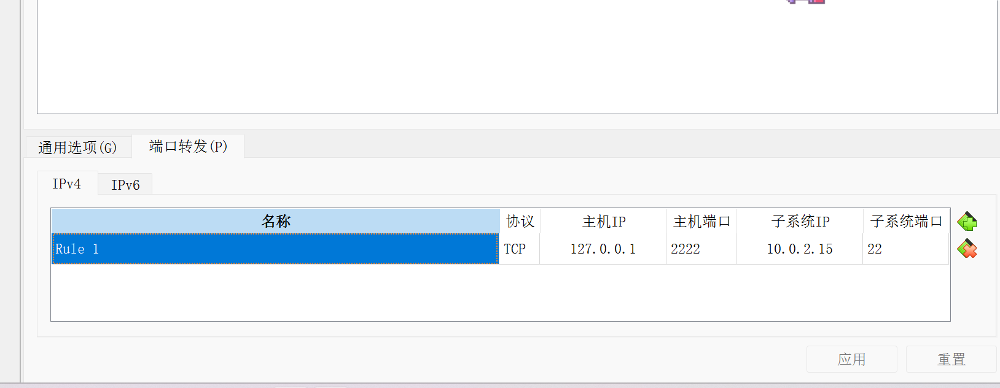
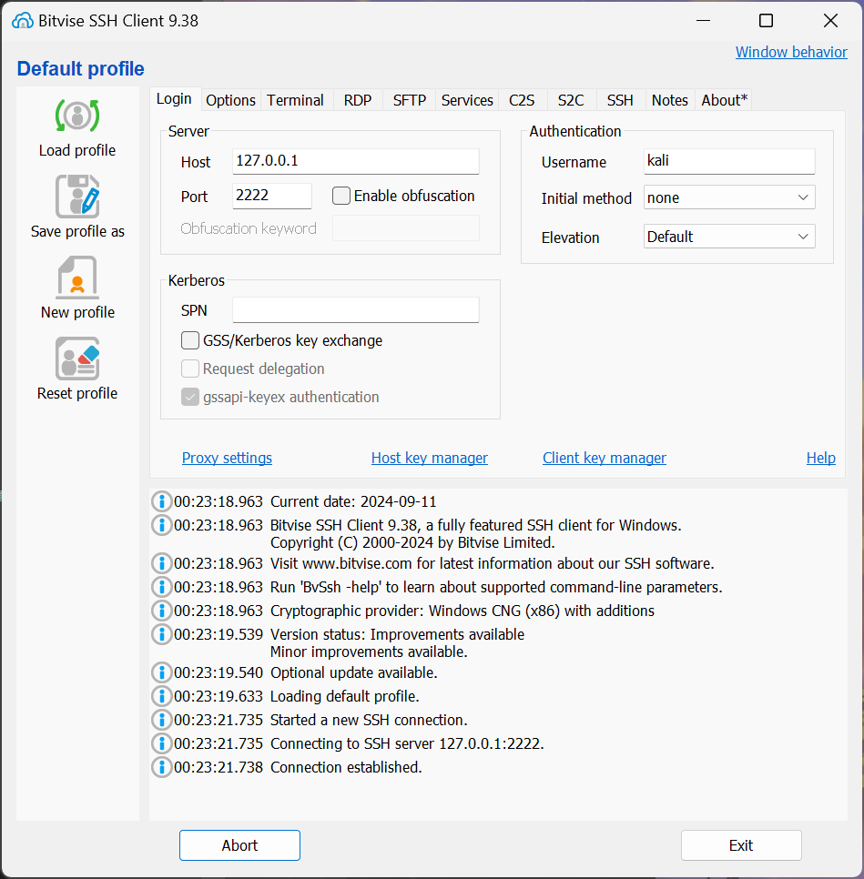

# 配置远程访问





```bash
drwxr-xr-x 2 kali kali 4096 Sep  3 06:31 Desktop
 ---------
```

d: 文件类型

前三个字符：root的权限 `rwx`
中间三个字符：组的权限 `r-x`
最后三个字符：其他用户的权限 `r-x`
- r: 可读：可以查看当前目录下的目录 `ls`
- w: 可写：可以在当前目录下创建、修改、删除文件
- x: 可执行：可以进入目录 `cd`

可执行最重要


获取帮助：
```bash
ls -h 
ls --help 
man ls
tldr ls  # 需要下载tldr

用`$`访问变量
```

```bash
echo $PATH
```

查找命令(手册)所在位置
```bash
└─$ whereis mount
mount: /usr/bin/mount /usr/share/man/man2/mount.2.gz /usr/share/man/man8/mount.8.gz
```

不同的手册：2是c语言手册，8是命令行手册
```bash
┌──(kali㉿kali)-[/]
└─$ man 2 mount
                                                                                                                                        
┌──(kali㉿kali)-[/]
└─$ man 8 mount
```

查看类型
```bash
┌──(kali㉿kali)-[/]
└─$ type mount 
mount is /usr/bin/mount  # 命令
                                                                                                                                        
┌──(kali㉿kali)-[/]
└─$ type cd   
cd is a shell builtin  # shell内置的函数功能
```

## find

```bash
find . -name src -type d  # 查找当前目录及其子目录下，名字为src的目录
find . -path `**/test/*.py` -type f # 查找
```


```bash
drwxrwxrwt  13 root root       4096 Sep 24 03:02 tmp
         ^
     sticky bit
```
t：是所有人都有全部权限的临时文件夹。但文件只有【文件拥有者】和【管理员】能删除。


shadow文件：存放密码

```bash
-rw-r----- 1 root shadow 1428 Sep 24 03:07 shadow
```

passwd如何修改只有root用户能读的密码文件？

```bash
-rwsr-xr-x 1 root root 72344 Feb  4  2024 /usr/bin/passwd
```

passwd命令有一个SUID，使得用户拥有了root用户的权限，从而能修改密码


change owner: 改变文件的拥有者

```bash
chown 
```


```
┌──(kali㉿kali)-[/etc]
└─$ grep kali passwd
kali:x:1000:1000:,,,:/home/kali:/usr/bin/zsh
                                                                                                                                        
┌──(kali㉿kali)-[/etc]
└─$ grep -C 2 kali passwd
inetsim:x:131:134::/var/lib/inetsim:/usr/sbin/nologin
_gvm:x:132:135::/var/lib/openvas:/usr/sbin/nologin
kali:x:1000:1000:,,,:/home/kali:/usr/bin/zsh

└─$ grep -v kali passwd  


```

# 管道符 |


# 重定向符 >


创建带空格的文件名：
```
mkdir 'ab cd'
mkdir ab\ cd
```


更改用户

```bash
┌──(kali㉿kali)-[~]
└─$ sudo -i         
[sudo] password for kali: 
┌──(root㉿kali)-[~]
└─# pwd
/root
                                                                                                                             
┌──(root㉿kali)-[~]
└─# ls
                                                                                                                             
┌──(root㉿kali)-[~]
└─# exit
                                                                                                                             
┌──(kali㉿kali)-[~]
└─$ sudo su                 
┌──(root㉿kali)-[/home/kali]
└─# cd
                                                                                                                             
┌──(root㉿kali)-[~]
└─# pwd
/root

```


